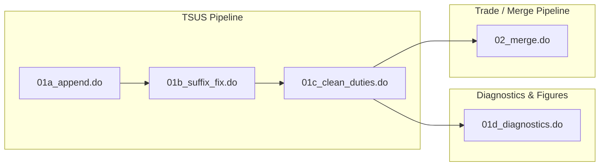

# DY--Analysis Integrated Guide Draft

This draft tests a combined documentation structure for the `DY--Analysis` workflow in `Shafaatyark/Tariffs-RAs`.

The main reading path follows the analysis scripts. Input and output data-file notes are kept inside one-level collapsible sections so the workflow stays readable while still preserving the data-guide context.

Source branch used for this draft: `Shafaatyark/Tariffs-RAs`, `DY--Analysis`.

## Workflow Overview



## Workflow Index

| Script | Main input | Main output | Purpose |
|---|---|---|---|
| `01a_append.do` | `verified_schedule1-8.xlsx` | `tsus_appended.dta` | Import, reshape, standardize, and append schedules 1-8 |
| `01b_suffix_fix.do` | `tsus_appended.dta` | `tsus_uncorrected.dta` | Clean suffixes, create TSUSA codes, apply reference-rate fixes, expand suffix rows, and extend years |
| `01c_clean_duties.do` | `tsus_uncorrected.dta` | `tsus_final.dta` | Clean duty variables and save the final cleaned TSUS tariff dataset |
| `01d_diagnostics.do` | `tsus_final.dta` | figures and diagnostic output | Generate tariff-rate histograms, scatter plots, box plots, and diagnostic lists |
| `02_merge.do` | `tsus_final.dta`, annual trade files | `tsus_final_weights.dta`, `trade_appended.dta`, `tsus_trade_merged.dta` | Create weights, append trade data, and merge tariff data with import trade data |

---

## 01a_append.do

### Purpose

`01a_append.do` imports verified schedule Excel files, reshapes year-specific duty variables from wide format to long format, appends schedules 1 through 8, standardizes suffix formatting, and saves the combined TSUS dataset.

Before appending the schedules, the script standardizes key identifier variables. `item` and `suffix` are converted to strings to preserve code formatting, and `flag` and `unit_spec` are converted to strings when Stata imports them as numeric. This prevents type mismatches across schedules without relying on `append, force`.

### Inputs

<details>
<summary>Input: verified_schedule1-8.xlsx</summary>


#### File Role in Workflow

`verified_schedule1-8.xlsx` represents the verified Excel schedule files created from the original TSUS PDFs. These files are the first structured data input in the TSUS workflow: they translate the raw tariff schedules into rows and columns that can be imported by [`01a_append.do`](../analysis_guide/01a_append.md).

This file guide explains the role of the verified schedules as data inputs. The detailed rules for entering, interpreting, and verifying TSUS schedule information are documented separately in [TSUS Source and Data Conventions](00b_tsus_source_and_data_conventions.md).

#### What This File Contains

The verified schedule files contain digitized TSUS schedule information for schedules 1 through 8. They preserve the core fields needed for later cleaning and analysis, including:

- tariff item codes;
- suffix codes;
- specific and ad valorem duty values;
- unit information;
- notes copied or summarized from the source schedules;
- flags for entries requiring special interpretation.

The schedules are stored as Excel files before being imported into Stata. Formatting choices such as text-formatted cells, preserved suffix values, and note fields matter because the later Stata scripts depend on these fields being readable and consistent.

#### How It Is Produced

The verified schedules are created by digitizing the original TSUS PDF schedules into Excel and then checking the entered data against the source documents. The digitization and verification process follows the conventions in [TSUS Source and Data Conventions](00b_tsus_source_and_data_conventions.md).

This guide does not restate those conventions. Instead, it documents the resulting Excel files as the workflow input used by the Stata pipeline.

</details>

### Outputs

<details>
<summary>Output: tsus_appended.dta</summary>


#### File Role in Workflow

`tsus_appended.dta` is the intermediate Stata dataset created from the verified Excel schedule files. It combines schedules 1-8 after import, type standardization, reshape, and append, and prepares the data for suffix cleaning and TSUSA code construction in [`01b_suffix_fix.do`](../analysis_guide/01b_suffix_fix.md).

#### Created From

- [`verified_schedule1-8.xlsx`](01a_verified_schedule1-8.xlsx.md)

#### Created By

- [`01a_append.do`](../analysis_guide/01a_append.md)

</details>

### How This Step Creates the Output

This step creates `tsus_appended.dta` by:

- Importing the verified Excel schedule files into Stata.
- Standardizing key columns so the schedule files can be combined safely.
- Reshaping year-specific duty columns into a long format.
- Appending schedules 1-8 into one combined dataset.
- Standardizing observed suffix formatting issues.
- Saving the combined result as `tsus_appended.dta`.

<details>
<summary>Full commented 01a_append.do code</summary>

```stata
clear all                  // Clears Stata's memory.
set more off               // Prevents output pauses.

cd "C:\Users\USER\Desktop\Tariff-RA-Data"   // Sets the working directory. Update this path to match your local project folder.

log using "Analysis\Codes\01a_append_log.smcl", replace   // Starts a log file.

global data "Analysis\Data Files"   // Defines the data folder path.

tempfile combined           // Creates a temporary file for the combined data.
local first = 1             // Identifies the first schedule.

forvalues schedule = 1/8 {  // Repeats the commands for schedules 1 through 8.

    import excel "$data\Raw Files\TSUS_data\verified_schedule`schedule'_test.xlsx", cellrange(A2) firstrow clear
    // Imports each Excel schedule. Uses row 2 as the variable names.

    tostring item suffix, replace
    // Converts item and suffix to strings to preserve formatting.

    capture confirm numeric variable flag
    if !_rc {
        tostring flag, replace
    }
    // Converts flag to a string if it is numeric.

    capture confirm numeric variable unit_spec
    if !_rc {
        tostring unit_spec, replace
    }
    // Converts unit_spec to a string if it is numeric.

    forvalues year = 1968/1972 {
        tostring duty1_spec`year' duty2_spec`year' duty1_ad`year' duty2_ad`year', replace force
    }
    // Converts the duty columns for 1968-1972 to strings.

    reshape long duty1_spec duty1_ad duty2_spec duty2_ad,
        i(item suffix units unit_spec flag notes) j(year)
    // Creates a separate observation for each item, suffix, and year.

    if `first' {
        save `combined'
        local first = 0
    }
    // Saves the first schedule as the temporary combined file.

    else {
        append using `combined'
        save `combined', replace
    }
    // Adds each later schedule to the temporary combined file after type standardization.
}

foreach var of varlist _all {
    quietly count if !missing(`var')
    if r(N) == 0 {
        drop `var'
    }
}
// Drops columns that contain no data.

replace suffix = "00" if suffix == "0"
replace suffix = "00" if suffix == "000"
replace suffix = "05" if suffix == "5"
// Standardizes incorrectly formatted suffix values.
//The schedules were checked for other one-digit suffix values, but only "0" and "5" were found. Therefore, the script manually standardizes only the observed inconsistent entries: "0" and "000" to "00", and "5" to "05".

sort item
// Sorts the dataset by item code before saving.

save "$data\Stata Files\tsus_appended.dta", replace
// Saves the combined dataset in item order.

log close
// Closes the log file.
```

</details>

---

## 01b_suffix_fix.do

### Purpose

`01b_suffix_fix.do` starts from the appended TSUS dataset, cleans suffix values, creates TSUSA codes, corrects ad valorem duty rates for selected related item groups using 320- and 301-series reference rates, expands suffix-specific rows for item groups 32000-33100, extends the dataset to 1973-1975 using 1972 as a template, cleans specific-duty variables, and saves the uncorrected TSUS dataset.

### Inputs

<details>
<summary>Input: tsus_appended.dta</summary>


#### File Role in Workflow

`tsus_appended.dta` is the intermediate Stata dataset created from the verified Excel schedule files. It combines schedules 1-8 after import, type standardization, reshape, and append, and prepares the data for suffix cleaning and TSUSA code construction in [`01b_suffix_fix.do`](../analysis_guide/01b_suffix_fix.md).

#### Created From

- [`verified_schedule1-8.xlsx`](01a_verified_schedule1-8.xlsx.md)

#### Created By

- [`01a_append.do`](../analysis_guide/01a_append.md)

</details>

### Outputs

<details>
<summary>Output: tsus_uncorrected.dta</summary>


#### File Role in Workflow

`tsus_uncorrected.dta` is the TSUS tariff dataset created after suffix cleaning, TSUSA code creation, rate fixes, row expansion, and year extension. In this workflow, "uncorrected" means that the dataset has not yet gone through the final duty-variable cleaning step in [`01c_clean_duties.do`](../analysis_guide/01c_clean_duties.md). It is the suffix-step output that used to be described as [`tsus_final.dta`](01d_tsus_final.dta.md) before the workflow split out the final duty-cleaning step.

#### Created From

- [`tsus_appended.dta`](01b_tsus_appended.dta.md)

#### Created By

- [`01b_suffix_fix.do`](../analysis_guide/01b_suffix_fix.md)

#### Used By

- [`01c_clean_duties.do`](../analysis_guide/01c_clean_duties.md)

</details>

### Code Explanation

The script builds suffix maps for 32000-33100 prefix groups, loads `tsus_appended.dta`, trims and validates suffix values, creates numeric TSUSA codes, and converts ad valorem duty variables to numeric. It then uses 320-series and 301-series reference-rate tables to calculate related rates, expands suffix `00` rows into valid suffix-specific rows, copies 1972 rows forward to 1973-1975, cleans specific-duty fields, and saves `tsus_uncorrected.dta`.

<details>
<summary>Full commented 01b_suffix_fix.do code</summary>

```stata
cd "C:\Users\USER\Desktop\Tariff-RA-Data"

log using "Analysis\Codes\01b_suffix_fix_log.smcl", replace

global data "Analysis\Data Files"

local suf_32000 "01 02 03 04 06 08 22 24 26 28 30 32 34 36 38 40 42 44 46 54 58 60 64 68 70 76 78 88 90 92 94"
local suf_32100 "01 02 03 04 06 08 22 24 26 28 30 32 34 44 46 54 58 60 64 68 70 76 78 88 90 92 94"
...
local suf_33100 "18 20 22 24 48 50 52 54 56 58 60 62 64 68 70 72 74 76 78 80 82 84 86 88 90 92 94"
// Stores the valid suffix codes for each 32000-33100 prefix group.
// These lists will later be used to expand rows with suffix "00" into multiple suffix rows.

tempfile suffix_map
// Creates a temporary file that will store the prefix-suffix mapping.

clear
// Clears the current dataset from memory.

gen str5 prefix = ""
gen str2 suffix = ""
// Creates empty string variables for prefix and suffix.

save `suffix_map'
// Saves the empty suffix map as a temporary Stata file.

foreach p in 32000 32100 32200 32300 32400 32500 32600 32700 32800 32900 33000 33100 {
    local suffixes "`suf_`p''"
    // Gets the suffix list for the current prefix.

    local n : word count `suffixes'
    // Counts how many suffix codes are in that list.

    clear
    set obs `n'

    gen str5 prefix = "`p'"
    // Fills the prefix variable with the current prefix, such as 32000.

    gen str2 suffix = ""
    // Creates an empty suffix variable.

    forvalues i = 1/`n' {
        replace suffix = "`: word `i' of `suffixes''" in `i'
    }
    // Fills each row with one suffix code from the suffix list.

    append using `suffix_map'
    // Adds the previously saved suffix-map rows to the current rows.

    save `suffix_map', replace
    // Saves the updated suffix map.
}

use "$data\Stata Files\tsus_appended.dta", clear

replace item = strtrim(item)
replace suffix = strtrim(suffix)
// Removes extra spaces from item and suffix.

display "===== Non-numeric suffix values before cleaning ====="
// Prints a heading in the log.

tab suffix if missing(real(suffix)) & suffix != "", missing
// Shows suffix values that cannot be converted to numbers.


list item suffix year notes ///
    if missing(real(suffix)) & suffix != "", ///
    sepby(item) clean
// Lists the problematic non-numeric suffix observations for inspection.

replace suffix = "" if inlist(suffix, ".", "1/")
// Removes known non-code suffix markers.
// These are not real suffix codes, so the script replaces them with blank suffix.

assert regexm(suffix, "^[0-9]*$")
// Stops the script if any unexpected non-numeric suffix remains.

display "===== Suffix cleaning completed successfully ====="
// Prints a success message after suffix cleaning.

gen tsusa_str = item + suffix
gen tsusa = real(tsusa_str)
drop tsusa_str
// Creates a numeric TSUSA code by combining item and suffix.
// The suffix variable itself stays as a string to preserve values like "01".

replace duty1_ad = strtrim(duty1_ad)
replace duty2_ad = strtrim(duty2_ad)
// Removes extra spaces from ad valorem duty variables.

destring duty1_ad, replace force
destring duty2_ad, replace force
// Converts duty1_ad and duty2_ad from strings to numeric variables.
// force means non-numeric values become missing.

capture drop duty1_ad_320 duty2_ad_320 suffix_base
// Drops old temporary variables if they already exist.

gen suffix_base = mod(tsusa, 10000)
// Keeps the last four digits of tsusa.
// Despite the name, suffix_base is not only the suffix.
// It captures the item tail plus suffix, so 3201500 and 3211500 both map to 1500.
// This lets each 321-331 item match the corresponding 320-series base item.

preserve
    keep if floor(tsusa / 10000) == 320 & year == 1968
    // Keeps only 1968 observations in the 320 series.

    rename duty1_ad duty1_ad_320
    rename duty2_ad duty2_ad_320
    // Renames 320-series duty variables so they can be used as reference rates.

    keep suffix_base year duty1_ad_320 duty2_ad_320
    // Keeps only the variables needed for the reference table.

    tempfile ref320
    save `ref320'
    // Saves the 320-series reference table.
restore
// Returns to the full dataset.

merge m:1 suffix_base using `ref320', keep(master match) nogen
// Merges one 320-series reference rate onto each matching observation.
// This is m:1 because many 321-331 rows can use one corresponding 320 base row.

drop if suffix_base == 8900 & inlist(floor(tsusa/10000), 321, 322, 323, 324, 325, 326, 327, 328, 329, 330, 331)
// Drops 321-331 observations with suffix base 8900 because suffix 89 does not exist.

replace duty1_ad = duty1_ad_320 + 2.3 if floor(tsusa/10000) == 321 & !missing(duty1_ad_320) & year == 1968
replace duty1_ad = duty1_ad_320 + 2.2 if floor(tsusa/10000) == 321 & !missing(duty1_ad_320) & year == 1969
replace duty1_ad = duty1_ad_320 + 2.1 if floor(tsusa/10000) == 321 & !missing(duty1_ad_320) & year == 1970
replace duty1_ad = duty1_ad_320 + 2 if floor(tsusa/10000) == 321 & !missing(duty1_ad_320) & year == 1971
replace duty1_ad = duty1_ad_320 + 1.9 if floor(tsusa/10000) == 321 & !missing(duty1_ad_320) & year == 1972
replace duty2_ad = duty2_ad_320 + 3 if floor(tsusa/10000) == 321
// Calculates 321-series duties by adding fixed increments to the 320-series reference duty.
// The duty1_ad increment changes by year.
// The duty2_ad increment is fixed for the whole 321 series.

* 322 through 331
// The following blocks repeat the same logic for series 322-331.
// For each series:
// 1. Identify the series using floor(tsusa/10000).
// 2. Use the matching 320-series duty as the base.
// 3. Add a series-specific and year-specific amount to duty1_ad.
// 4. Add a series-specific fixed amount to duty2_ad.

drop suffix_base duty1_ad_320 duty2_ad_320
// Drops temporary variables used for the 320-series calculations.

capture drop duty1_ad_301
gen prefix_base = floor(tsusa / 100)
// Starts the 301/302 series calculation.
// prefix_base removes the last two digits from tsusa.

preserve
    keep if floor(tsusa / 10000) == 301 & year == 1968
    // Keeps only 1968 observations in the 301 series.

    rename duty1_ad duty1_ad_301
    // Renames duty1_ad so it can be used as the 301 reference rate.

    keep prefix_base year duty1_ad_301
    // Keeps only variables needed for the reference table.

    replace prefix_base = prefix_base + 100
    // Shifts the 301 prefix_base so it will match the related 302 observations.

    tempfile ref301
    save `ref301'
    // Saves the 301-series reference table.
restore

merge m:1 prefix_base using `ref301', keep(master match) nogen
// Merges the 301 reference duty onto related 302 observations.

replace duty1_ad = duty1_ad_301 + 4.2 if floor(tsusa/10000) == 302 & !missing(duty1_ad_301) & year == 1968
replace duty1_ad = duty1_ad_301 + 4.0 if floor(tsusa/10000) == 302 & !missing(duty1_ad_301) & year == 1969
replace duty1_ad = duty1_ad_301 + 3.7 if floor(tsusa/10000) == 302 & !missing(duty1_ad_301) & year == 1970
replace duty1_ad = duty1_ad_301 + 3.5 if floor(tsusa/10000) == 302 & !missing(duty1_ad_301) & year == 1971
replace duty1_ad = duty1_ad_301 + 3.25 if floor(tsusa/10000) == 302 & !missing(duty1_ad_301) & year == 1972
// Calculates 302-series duty1_ad by adding year-specific increments to the 301 reference duty.

drop prefix_base duty1_ad_301 tsusa
// Drops temporary 301/302 variables and the numeric tsusa variable.

tempfile full_data
save `full_data'
// Saves the current full dataset temporarily.
// In this script, this temporary file is saved but not used later.

gen str5 prefix = substr(item,1,3) + "00"
// Creates a prefix such as 32000 from the first three digits of item.

gen byte to_expand = ///
    (inlist(prefix,"32000","32100","32200","32300","32400","32500","32600","32700") | ///
     inlist(prefix,"32800","32900","33000","33100")) & (suffix == "00")
// Marks rows that should be expanded.
// Only 32000-33100 prefixes with suffix "00" are expanded.

preserve
    keep if to_expand == 1
    // Keeps only rows that need suffix expansion.

    drop suffix to_expand
    // Drops the old suffix "00" before adding the valid suffix list.

    joinby prefix using `suffix_map'
    // Joins each prefix row with all valid suffixes for that prefix.
    // This expands one "00" row into many suffix-specific rows.

    drop prefix
    // Drops prefix after expansion.

    tempfile expanded
    save `expanded'
    // Saves the expanded rows.
restore

drop if to_expand == 1
// Removes the original unexpanded suffix "00" rows.

drop to_expand prefix
// Drops temporary expansion variables.

append using `expanded'
// Adds the expanded suffix rows back into the dataset.

gen tsusa = item + suffix
// Recreates the TSUSA code after suffix expansion.
// Here it is created from string item + string suffix.

preserve
    keep if year == 1972
    // Uses 1972 as the template for future years.

    tempfile template
    save `template'
    // Saves the 1972 rows as a template.

    replace year = 1973
    tempfile rows_1973
    save `rows_1973'
    // Creates 1973 rows copied from 1972.

    use `template', clear
    replace year = 1974
    tempfile rows_1974
    save `rows_1974'
    // Creates 1974 rows copied from 1972.

    use `template', clear
    replace year = 1975
    tempfile rows_1975
    save `rows_1975'
    // Creates 1975 rows copied from 1972.
restore

append using `rows_1973'
append using `rows_1974'
append using `rows_1975'
// Adds the 1973, 1974, and 1975 rows to the dataset.

foreach var of varlist duty1_spec* duty2_spec* {
    split `var', parse(";") gen(duty_part)
    // Splits specific-duty variables at the semicolon.

    gen `var'_new = cond(missing(duty_part2), duty_part1, duty_part2)
    // If there is no second part, keeps the first part.
    // If there is a second part, keeps the second part.

    drop duty_part1 duty_part2
    // Drops the temporary split variables.

    replace `var'_new = strtrim(`var'_new)
    // Removes extra spaces.

    destring `var'_new, replace
    // Converts the cleaned value to numeric.

    drop `var'
    rename `var'_new `var'
    // Replaces the original variable with the cleaned numeric version.
}

tab year
// Shows how many observations exist for each year.

save "$data\Stata Files\tsus_uncorrected.dta", replace

log close
```

</details>

---

## 01c_clean_duties.do

### Purpose

`01c_clean_duties.do` loads the uncorrected TSUS dataset from `01b_suffix_fix.do`, checks duty variables for non-numeric and missing values, converts duty variables to numeric format, applies the existing ad valorem duty correction logic, and saves the final cleaned TSUS dataset.

### Inputs

<details>
<summary>Input: tsus_uncorrected.dta</summary>


#### File Role in Workflow

`tsus_uncorrected.dta` is the TSUS tariff dataset created after suffix cleaning, TSUSA code creation, rate fixes, row expansion, and year extension. In this workflow, "uncorrected" means that the dataset has not yet gone through the final duty-variable cleaning step in [`01c_clean_duties.do`](../analysis_guide/01c_clean_duties.md). It is the suffix-step output that used to be described as [`tsus_final.dta`](01d_tsus_final.dta.md) before the workflow split out the final duty-cleaning step.

#### Created From

- [`tsus_appended.dta`](01b_tsus_appended.dta.md)

#### Created By

- [`01b_suffix_fix.do`](../analysis_guide/01b_suffix_fix.md)

#### Used By

- [`01c_clean_duties.do`](../analysis_guide/01c_clean_duties.md)

</details>

### Outputs

<details>
<summary>Output: tsus_final.dta</summary>


#### File Role in Workflow

`tsus_final.dta` is the cleaned TSUS tariff dataset created after the suffix-fixed intermediate data has gone through final duty-variable cleaning and rate corrections. It is the main cleaned tariff file used for diagnostics, figures, weights, and trade-data merges.

#### Created From

- [`tsus_uncorrected.dta`](01c_tsus_uncorrected.dta.md)

#### Created By

- [`01c_clean_duties.do`](../analysis_guide/01c_clean_duties.md)

#### Used By

- [`01d_diagnostics.do`](../analysis_guide/01d_diagnostics.md)
- [`02_merge.do`](../analysis_guide/02_merge.md)

</details>

### Code Explanation

The script loads `tsus_uncorrected.dta`, inspects duty-variable types, sorts the data, trims specific-duty strings, lists non-numeric duty entries, counts missing values, temporarily recodes `base rate` as `999999`, verifies that non-numeric characters have been handled, destrings duty variables and identifiers, fills selected later-year ad valorem values from 1968 when later years are all zero, and saves `tsus_final.dta`.

<details>
<summary>Full commented 01c_clean_duties.do code</summary>

```stata
cd "C:\Users\USER\Desktop\Tariff-RA-Data"
// Set the working folder for the project.

log using "Analysis\Codes\01c_clean_duties_log.smcl", replace
// Save the Stata output from this script in a log file.

global data "Analysis\Data Files"
// Store the data folder path in the global macro $data.

use "$data\Stata Files\tsus_uncorrected.dta", clear
// Load the suffix-fixed dataset before final duty cleaning.

describe duty1_spec* duty1_ad* duty2_spec* duty2_ad*
// Check the storage types and labels for the duty variables.

sort item suffix year
// Sort records by item, suffix, and year so each tariff line is organized over time.


*Note 3356530 was manually changed from 8.5. to 8.5
replace duty1_spec = strtrim(duty1_spec)
// Remove extra spaces around column 1 specific-duty values.

replace duty2_spec = strtrim(duty2_spec)
// Remove extra spaces around column 2 specific-duty values.


*These are here to verfiy that there are no missing or non-numeric vaues in the duty columns
foreach var of varlist duty1_spec* duty1_ad* duty2_spec* duty2_ad* {
    capture confirm string variable `var'
    // Check whether the current duty variable is stored as a string.

    if !_rc {
        display "Non-numeric values in `var':"
        // Print the variable name before listing problematic values.

        list item suffix `var' if !regexm(`var', "^[0-9]*\.?[0-9]*$") & !missing(`var'), clean
        // List non-missing values that are not simple numbers.
    }
}

foreach var of varlist duty1_spec* duty1_ad* duty2_spec* duty2_ad* {
    capture confirm string variable `var'
    // Check whether the current duty variable is stored as a string.

    if !_rc {
        count if `var' == ""
        // Count blank string values.

        display "Variable `var' has " r(N) " missing (empty string) values"
        // Report the number of blank string values.
    }
    else {
        count if missing(`var')
        // Count numeric missing values.

        display "Variable `var' has " r(N) " missing (numeric) values"
        // Report the number of numeric missing values.
    }
}

*This is for the issue of the "base rate" entries in specific duty columns
replace duty1_spec = "999999" if duty1_spec == "base rate"
// Temporarily convert "base rate" text in column 1 specific duty so the variable can be destringed.

replace duty2_spec = "999999" if duty2_spec == "base rate"
// Temporarily convert "base rate" text in column 2 specific duty so the variable can be destringed.


* Verify all Non-numeric charecters have been accounted for
foreach var of varlist duty1_spec* duty1_ad* duty2_spec* duty2_ad* {
    capture confirm string variable `var'
    // Re-check string duty variables after the "base rate" replacement.

    if !_rc {
        display "Non-numeric values in `var':"
        // Print the variable name before listing any remaining problematic values.

        list item suffix `var' if !regexm(`var', "^[0-9]*\.?[0-9]*$") & !missing(`var'), clean
        // Confirm that no non-numeric strings remain.
    }
}

destring duty1_spec duty1_ad duty2_spec duty2_ad tsusa item , replace
// Convert duty variables, TSUSA codes, and item codes from strings to numeric values.

bysort tsusa: egen mean_6975 = mean(duty1_ad) if inrange(year, 1969, 1975)
// For each TSUSA code, compute the mean column 1 ad valorem duty in 1969-1975.

bysort tsusa: egen mean_post68 = max(mean_6975)
// Store that post-1968 mean on each row for the same TSUSA code.

gen duty1_ad_1968 = duty1_ad if year == 1968
// Keep the 1968 column 1 ad valorem duty only on 1968 rows.

bysort tsusa: egen val_1968 = max(duty1_ad_1968)
// Carry the 1968 value to every row for the same TSUSA code.

replace duty1_ad = val_1968 if inrange(year, 1969, 1975) & mean_post68 == 0 & val_1968 > 0 & !missing(val_1968)
// If 1969-1975 are all zero but 1968 is positive, fill those later years with the 1968 value.

drop mean_6975 mean_post68 duty1_ad_1968 val_1968
// Drop temporary helper variables.

bysort tsusa: egen mean_6975 = mean(duty2_ad) if inrange(year, 1969, 1975)
// Repeat the same post-1968 check for column 2 ad valorem duties.

bysort tsusa: egen mean_post68 = max(mean_6975)
// Store the grouped post-1968 mean.

gen duty2_ad_1968 = duty2_ad if year == 1968
// Keep the 1968 column 2 ad valorem duty only on 1968 rows.

bysort tsusa: egen val_1968 = max(duty2_ad_1968)
// Carry the 1968 value to every row for the same TSUSA code.

replace duty2_ad = val_1968 if inrange(year, 1969, 1975) & mean_post68 == 0 & val_1968 > 0 & !missing(val_1968)
// If 1969-1975 are all zero but 1968 is positive, fill those later years with the 1968 value.

drop mean_6975 mean_post68 duty2_ad_1968 val_1968
// Drop temporary helper variables.

tab year
// Shows how many observations exist for each year.

save "$data\Stata Files\tsus_final.dta", replace
// Save the final cleaned tariff dataset.

log close
```

</details>

---

## 01d_diagnostics.do

### Purpose

`01d_diagnostics.do` loads the final cleaned TSUS dataset, creates histograms, scatter plots, box plots, and diagnostic lists for ad valorem duty rates, and exports figure files. It does not save a new `.dta` dataset.

### Inputs

<details>
<summary>Input: tsus_final.dta</summary>


#### File Role in Workflow

`tsus_final.dta` is the cleaned TSUS tariff dataset created after the suffix-fixed intermediate data has gone through final duty-variable cleaning and rate corrections. It is the main cleaned tariff file used for diagnostics, figures, weights, and trade-data merges.

#### Created From

- [`tsus_uncorrected.dta`](01c_tsus_uncorrected.dta.md)

#### Created By

- [`01c_clean_duties.do`](../analysis_guide/01c_clean_duties.md)

#### Used By

- [`01d_diagnostics.do`](../analysis_guide/01d_diagnostics.md)
- [`02_merge.do`](../analysis_guide/02_merge.md)

</details>

### Outputs

<details>
<summary>Output: diagnostic figures and log files</summary>

</details>

### Code Explanation

The script loads `tsus_final.dta`, exports histograms for column 1 and column 2 ad valorem duty rates, reshapes selected data to compare 1968 and 1972 rates side by side, creates scatter plots with reference lines, generates a box-and-whisker plot by year, counts high-end outliers, lists unusual duty-rate patterns, and exports highlighted diagnostic figures.

<details>
<summary>Full commented 01d_diagnostics.do code</summary>

```stata
cd "C:\Users\USER\Desktop\Tariff-RA-Data"
// Set the working folder for the project.

log using "Analysis\Codes\01d_diagnostics_log.smcl", replace
// Save the Stata output from this script in a log file.

global data "Analysis\Data Files"
// Store the data folder path in the global macro $data.

global figures "Analysis\Figures"
// Store the figures folder path in the global macro $figures.

use "$data\Stata Files\tsus_final.dta", clear
// Load the final cleaned TSUS tariff dataset.

histogram duty1_ad if year == 1968
graph export "$figures/Histogram_ad1_1968.pdf", as(pdf) replace
histogram duty1_ad if year == 1972
graph export "$figures/Histogram_ad1_1972.pdf", as(pdf) replace
histogram duty2_ad if year == 1968
graph export "$figures/Histogram_ad2_1968.pdf", as(pdf) replace
histogram duty2_ad if year == 1972
graph export "$figures/Histogram_ad2_1972.pdf", as(pdf) replace
// Create and export basic histograms for column 1 and column 2 ad valorem duty rates in 1968 and 1972.
// These graphs show the distribution of duty rates and help identify spikes, zeros, and unusually high values.


preserve
gen duty_1968 = duty1_ad if year == 1968
gen duty_1972 = duty1_ad if year == 1972
keep duty1_ad year tsusa
reshape wide duty1_ad, i(tsusa) j(year)
summarize duty1_ad1968
local xmax = r(max)
twoway (scatter duty1_ad1972 duty1_ad1968) (function y = x, range(0 `xmax') lcolor(red) lpattern(solid)) (function y = 0.5*x, range(0 `xmax') lcolor(blue) lpattern(dash)), xtitle("Ad Valorem Duty 1968") ytitle("Ad Valorem Duty 1972") title("Duty Rates: 1968 vs 1972") legend(label(1 "TSUSA codes") label(2 "y=x") label(3 "y=0.5x"))
graph export "$figures/1968_1972_adval_1_scatter.pdf", as(pdf) replace
list tsusa if duty1_ad1972 > duty1_ad1968 & !missing(duty1_ad1972) & !missing(duty1_ad1968)
restore
// Temporarily reshapes column 1 ad valorem duties from long to wide format.
// After reshaping, each TSUSA code has side-by-side variables such as duty1_ad1968 and duty1_ad1972.
// The scatter plot compares 1972 rates against 1968 rates for the same TSUSA codes.
// The y = x line marks no change, and the y = 0.5*x line marks a 50 percent reduction.
// preserve and restore return the dataset to its original long format after the diagnostic graph.

preserve
gen duty_1968 = duty2_ad if year == 1968
gen duty_1972 = duty2_ad if year == 1972
keep duty2_ad year tsusa
reshape wide duty2_ad, i(tsusa) j(year)
twoway scatter duty2_ad1972 duty2_ad1968, xtitle("Ad Valorem Duty 1968") ytitle("Ad Valorem Duty 1972") title("Duty Rates: 1968 vs 1972")
graph export "$figures/1968_1972_adval_2_scatter.pdf", as(pdf) replace
restore
// Repeats the same 1968-versus-1972 comparison for column 2 ad valorem duties.
// This checks whether column 2 rates show unusual increases, decreases, or missing patterns.


preserve
gen duty_1968 = duty1_ad if year == 1968
gen duty_1972 = duty1_ad if year == 1972
keep duty1_ad year tsusa
reshape wide duty1_ad, i(tsusa) j(year)
summarize duty1_ad1968
local xmax = r(max)

twoway (scatter duty1_ad1972 duty1_ad1968) (function y = x, range(0 `xmax') lcolor(red) lpattern(solid)) (function y=0.75*x, range(0 `xmax') lcolor(black) lpattern(shortdash)) (function y = 0.5*x, range(0 `xmax') lcolor(blue) lpattern(dash)), xtitle("Ad Valorem Duty 1968") ytitle("Ad Valorem Duty 1972") title("Duty Rates: 1968 vs 1972 After Fix") legend(label(1 "TSUSA codes") label(2 "y=x") label(3 "y=0.75x") label(4 "y=0.5x"))
graph export "$figures/1968_1972_adval_1_scatter_after_fix.pdf", as(pdf) replace

twoway (bar duty1_ad1968 tsusa, color(navy)) (bar duty1_ad1972 tsusa, color(teal)), legend(label(1 "1968") label(2 "1972")) title("Duty Rates by TSUSA") xtitle("TSUSA") ytitle("Ad Valorem Duty Rate")
restore
// Creates an after-fix comparison for column 1 ad valorem duties.
// The extra reference lines, y = 0.75*x and y = 0.5*x, make large rate reductions easier to see.
// The bar chart provides another visual comparison of 1968 and 1972 rates by TSUSA code.

preserve
gen duty_1968 = duty2_ad if year == 1968
gen duty_1972 = duty2_ad if year == 1972
keep duty2_ad year tsusa
reshape wide duty2_ad, i(tsusa) j(year)
twoway scatter duty2_ad1972 duty2_ad1968, xtitle("Ad Valorem Duty 1968") ytitle("Ad Valorem Duty 1972") title("Duty Rates: 1968 vs 1972")
graph export "$figures/1968_1972_adval_2_scatter_after_fix.pdf", as(pdf) replace
restore
// Creates the after-fix scatter plot for column 2 ad valorem duties.
// This is the column 2 counterpart to the column 1 after-fix comparison above.

preserve
drop if year > 1972
graph hbox duty1_ad, nooutside over(year) title("Distribution of Ad Valorem Duty Rates by Year", size(medium) color(black)) ytitle("Ad Valorem Duty Rate", size(small)) box(1, color(navy) lcolor(navy%80)) medtype(cline) medline(lcolor(white) lwidth(medium)) marker(1, mcolor(navy%50) msize(vsmall)) outergap(20) plotregion(fcolor(gs15) lcolor(none)) graphregion(fcolor(white) lcolor(none)) scheme(s2color)
graph export "$figures/1968_1975_box_whisker.pdf", as(pdf) replace
restore
// Creates a box-and-whisker plot of column 1 ad valorem duty rates by year.
// The plot summarizes the yearly distribution and helps identify unusually high duty rates.

forvalues yr = 1968/1972 {
    quietly summarize duty1_ad if year == `yr', detail
    local q1 = r(p25)
    local q3 = r(p75)
    local iqr = `q3' - `q1'
    local upper = `q3' + 1.5*`iqr'

    count if year == `yr' & duty1_ad > `upper'
    display "Year `yr': " r(N) " outliers above upper whisker"
}
// Counts high-end outliers by year using the standard box-plot upper-whisker rule.
// For each year, the script calculates Q3 + 1.5 * IQR and counts duty1_ad values above that cutoff.


histogram duty1_ad if year == 1968
graph export "$figures/Histogram_ad1_1968_after_fix.pdf", as(pdf) replace
histogram duty1_ad if year == 1972
graph export "$figures/Histogram_ad1_1972_after_fix.pdf", as(pdf) replace
histogram duty2_ad if year == 1968
graph export "$figures/Histogram_ad2_1968_after_fix.pdf", as(pdf) replace
histogram duty2_ad if year == 1972
graph export "$figures/Histogram_ad2_1972_after_fix.pdf", as(pdf) replace
// Create and export the after-fix histograms.
// These use the cleaned final dataset and are used to compare the post-cleaning distribution of duty rates.


preserve
gen duty_1968 = duty1_ad if year == 1968
gen duty_1972 = duty1_ad if year == 1972
keep duty1_ad year tsusa
reshape wide duty1_ad, i(tsusa) j(year)
list tsusa if duty1_ad1972 == 0 & duty1_ad1968 > 0 & duty1_ad1971 == 0 & !missing(duty1_ad1968)
list if duty1_ad1968 == 0 & duty1_ad1972 > 0
list tsusa if duty1_ad1972 > duty1_ad1968
 list tsusa if duty1_ad1972 < 1 & duty1_ad1968 > 10 & duty1_ad1971 == 0 & !missing(duty1_ad1968)
 list if duty1_ad1968 > 30 & duty1_ad1968 < 40 & duty1_ad1972 > 10 & duty1_ad1972 < 20
 list tsusa if duty1_ad1972 < 5 & duty1_ad1968 > 10 & !missing(duty1_ad1968)
 list tsusa if duty1_ad1972 == 0 & duty1_ad1968 >= 5 & duty1_ad1968 < 12
 list tsusa if duty1_ad1972 < 0.5 * duty1_ad1968 & duty1_ad1972 != 0
// This block reshapes duty1_ad into wide format so 1968, 1971, and 1972 rates
// can be compared side by side for each TSUSA code. The list commands flag
// unusual 1968-1972 ad valorem duty changes, including cases where a positive
// 1968 rate becomes zero or near zero by 1972, cases where 1972 is higher than
// 1968, and cases where the 1972 rate falls to less than half of the 1968 rate.


 gen highlight = inlist(tsusa, 2401200, 2403200, 2405200)
 twoway (scatter duty1_ad1972 duty1_ad1968 if highlight == 0, mcolor(gs10)) (scatter duty1_ad1972 duty1_ad1968 if highlight == 1, mcolor(red)) (function y = x, range(0 `xmax') lcolor(red) lpattern(solid)) (function y=0.75*x, range(0 `xmax') lcolor(black) lpattern(shortdash)) (function y = 0.5*x, range(0 `xmax') lcolor(blue) lpattern(dash)), xtitle("Ad Valorem Duty 1968") ytitle("Ad Valorem Duty 1972") title("Duty Rates: 1968 vs 1972 After Fix") legend(label(1 "TSUSA codes") label(2 "outliers") label(3 "y=x") label(4 "y=0.75x") label(5 "y=0.5x"))
 graph export "$figures/1968_1972_scatter_outliers.pdf", as(pdf) replace
restore
// Lists diagnostic cases with unusual 1968-1972 duty-rate patterns.
// These include cases where 1972 is zero despite a positive 1968 rate, cases where 1972 exceeds 1968, and cases where 1972 falls sharply relative to 1968.
// The final scatter plot highlights selected TSUSA outliers in red so they are easier to inspect visually.

*These are non essential, just for me to visualize how ad val rates for each item number compare
twoway (bar duty1_ad item if year == 1968, color(navy)) (bar duty1_ad item if year == 1972, color(red)), legend(label(1 "1968") label(2 "1972")) title("Duty Rates by ITEM") xtitle("ITEM") ytitle("Ad Valorem Duty Rate")
twoway (bar duty1_ad item) if year == 1968
twoway (bar duty1_ad item) if year == 1972
twoway (bar duty2_ad item) if year == 1968
twoway (bar duty2_ad item) if year == 1972
// Optional item-level bar charts for visual inspection.
// These are exploratory checks and are not exported as formal output files in this script.


log close
```

</details>

---

## 02_merge.do

### Purpose

`02_merge.do` prepares the final TSUS data for merging, creates a product-level weight file from 1976 import quantities, appends import data for 1968 through 1972, and merges the trade data onto the cleaned TSUS dataset.

The script saves three downstream datasets. First, it saves `tsus_final_weights.dta`, which adds quantity-based `spec_weight` values to selected TSUS items. Second, it saves `trade_appended.dta`, which combines the 1968-1972 import files. Third, it saves `tsus_trade_merged.dta`, which combines the cleaned TSUS tariff data with annual import data by `tsusa` and `year`.

### Inputs

<details>
<summary>Input: tsus_final.dta</summary>


#### File Role in Workflow

`tsus_final.dta` is the cleaned TSUS tariff dataset created after the suffix-fixed intermediate data has gone through final duty-variable cleaning and rate corrections. It is the main cleaned tariff file used for diagnostics, figures, weights, and trade-data merges.

#### Created From

- [`tsus_uncorrected.dta`](01c_tsus_uncorrected.dta.md)

#### Created By

- [`01c_clean_duties.do`](../analysis_guide/01c_clean_duties.md)

#### Used By

- [`01d_diagnostics.do`](../analysis_guide/01d_diagnostics.md)
- [`02_merge.do`](../analysis_guide/02_merge.md)

</details>

<details>
<summary>Input: annual import trade files</summary>

</details>

### Outputs

<details>
<summary>Output: tsus_final_weights.dta</summary>


#### File Role in Workflow

`tsus_final_weights.dta` is an intermediate weighted tariff file created by calculating quantity-based `spec_weight` values from 1976 import data and merging those weights onto the cleaned TSUS dataset.

#### Created From

- [`tsus_final.dta`](01d_tsus_final.dta.md)
- [`Imports-1976.dta`](https://sumailsyr-my.sharepoint.com/shared?id=%2Fpersonal%2Fskhan78%5Fsyr%5Fedu%2FDocuments%2FTariff%2DRA%2DData%2FAnalysis%2FData%20Files%2FRaw%20Files%2FTrade%5Fdata&listurl=%2Fpersonal%2Fskhan78%5Fsyr%5Fedu%2FDocuments&viewid=86dc3307%2D03bb%2D450c%2D8873%2D3d25737bc75a&sharingv2=true&fromShare=true&at=9&CT=1779052695969&OR=OWA%2DNT%2DMail&FolderCTID=0x012000FA572F48052EFB478E38BA7D6582FC25)

#### Created By

- [`02_merge.do`](../analysis_guide/02_merge.md)

</details>

<details>
<summary>Output: trade_appended.dta</summary>


#### File Role in Workflow

`trade_appended.dta` is the combined import trade dataset created from the 1968-1972 raw import files. It is used as the trade-data input for creating [`tsus_trade_merged.dta`](02b_tsus_trade_merged.dta.md).

#### Created From

- [`Imports-1968.dta`](https://sumailsyr-my.sharepoint.com/shared?id=%2Fpersonal%2Fskhan78%5Fsyr%5Fedu%2FDocuments%2FTariff%2DRA%2DData%2FAnalysis%2FData%20Files%2FRaw%20Files%2FTrade%5Fdata&listurl=%2Fpersonal%2Fskhan78%5Fsyr%5Fedu%2FDocuments&viewid=86dc3307%2D03bb%2D450c%2D8873%2D3d25737bc75a&sharingv2=true&fromShare=true&at=9&CT=1779052695969&OR=OWA%2DNT%2DMail&FolderCTID=0x012000FA572F48052EFB478E38BA7D6582FC25)
- [`Imports-1969.dta`](https://sumailsyr-my.sharepoint.com/shared?id=%2Fpersonal%2Fskhan78%5Fsyr%5Fedu%2FDocuments%2FTariff%2DRA%2DData%2FAnalysis%2FData%20Files%2FRaw%20Files%2FTrade%5Fdata&listurl=%2Fpersonal%2Fskhan78%5Fsyr%5Fedu%2FDocuments&viewid=86dc3307%2D03bb%2D450c%2D8873%2D3d25737bc75a&sharingv2=true&fromShare=true&at=9&CT=1779052695969&OR=OWA%2DNT%2DMail&FolderCTID=0x012000FA572F48052EFB478E38BA7D6582FC25)
- [`Imports-1970.dta`](https://sumailsyr-my.sharepoint.com/shared?id=%2Fpersonal%2Fskhan78%5Fsyr%5Fedu%2FDocuments%2FTariff%2DRA%2DData%2FAnalysis%2FData%20Files%2FRaw%20Files%2FTrade%5Fdata&listurl=%2Fpersonal%2Fskhan78%5Fsyr%5Fedu%2FDocuments&viewid=86dc3307%2D03bb%2D450c%2D8873%2D3d25737bc75a&sharingv2=true&fromShare=true&at=9&CT=1779052695969&OR=OWA%2DNT%2DMail&FolderCTID=0x012000FA572F48052EFB478E38BA7D6582FC25)
- [`Imports-1971.dta`](https://sumailsyr-my.sharepoint.com/shared?id=%2Fpersonal%2Fskhan78%5Fsyr%5Fedu%2FDocuments%2FTariff%2DRA%2DData%2FAnalysis%2FData%20Files%2FRaw%20Files%2FTrade%5Fdata&listurl=%2Fpersonal%2Fskhan78%5Fsyr%5Fedu%2FDocuments&viewid=86dc3307%2D03bb%2D450c%2D8873%2D3d25737bc75a&sharingv2=true&fromShare=true&at=9&CT=1779052695969&OR=OWA%2DNT%2DMail&FolderCTID=0x012000FA572F48052EFB478E38BA7D6582FC25)
- [`Imports-1972.dta`](https://sumailsyr-my.sharepoint.com/shared?id=%2Fpersonal%2Fskhan78%5Fsyr%5Fedu%2FDocuments%2FTariff%2DRA%2DData%2FAnalysis%2FData%20Files%2FRaw%20Files%2FTrade%5Fdata&listurl=%2Fpersonal%2Fskhan78%5Fsyr%5Fedu%2FDocuments&viewid=86dc3307%2D03bb%2D450c%2D8873%2D3d25737bc75a&sharingv2=true&fromShare=true&at=9&CT=1779052695969&OR=OWA%2DNT%2DMail&FolderCTID=0x012000FA572F48052EFB478E38BA7D6582FC25)

#### Created By

- [`02_merge.do`](../analysis_guide/02_merge.md)

</details>

<details>
<summary>Output: tsus_trade_merged.dta</summary>


#### File Role in Workflow

`tsus_trade_merged.dta` is the analysis-ready merge output that combines cleaned TSUS tariff data with appended 1968-1972 import trade files by `tsusa` and `year`.

#### Created From

- [`tsus_final.dta`](01d_tsus_final.dta.md)
- [`trade_appended.dta`](02a_trade_appended.dta.md)

#### Created By

- [`02_merge.do`](../analysis_guide/02_merge.md)

</details>

### Code Explanation

The script loads `tsus_final.dta`, converts `tsusa` to numeric, saves the cleaned tariff file, loads 1976 import data to calculate quantity-based `spec_weight`, collapses weights to one row per `tsusa`, merges those weights onto the cleaned TSUS data, and saves `tsus_final_weights.dta`. It then loads the 1968 import file, appends the 1969-1972 import files, converts `tsusa` to numeric, saves `trade_appended.dta`, reloads `tsus_final.dta`, merges trade data by `tsusa` and `year`, and saves `tsus_trade_merged.dta`.

<details>
<summary>Full commented 02_merge.do code</summary>

```stata
cd "C:\Users\USER\Desktop\Tariff-RA-Data"

log using "Analysis\Codes\02_merge_log.smcl", replace

global data "Analysis\Data Files"

use "$data\Stata Files\tsus_final.dta", clear
// Loads the cleaned TSUS dataset created by the earlier scripts.

destring tsusa, replace
// Converts tsusa from a string to a numeric variable so it can be used in numeric merges.

save "$data\Stata Files\tsus_final.dta", replace

use "$data\Raw Files\Trade_data\1976\Imports-1976.dta", clear

destring tsusa, replace
// Converts tsusa to numeric in the 1976 trade data.

keep if floor(tsusa / 1000000) == 6
// Keeps only TSUS items that begin with schedule 6.

gen spec_weight = con_qy2_yr / (con_qy1_yr + con_qy2_yr)
// Calculates the share of quantity 2 in total quantity 1 plus quantity 2.

keep if inlist(tsusa, 6012800, 6013300, 6015400, ..., 6292500, 6292800, 6293200, 6324200)
// Keeps the specific TSUS items that need product weights.
// The full do-file contains the complete list of TSUS codes; it is shortened here for readability.

collapse (mean) spec_weight, by(tsusa)
// Reduces the 1976 trade data to one average spec_weight value per tsusa item.

merge 1:m tsusa using "$data\Stata Files\tsus_final.dta", nogen
// Merges one spec_weight value per tsusa item onto multiple TSUS rows for the same tsusa.
// The 1976 trade data was collapsed to one row per tsusa, while tsus_final.dta can contain
// repeated tsusa values across years or tariff observations.
save "$data\Stata Files\tsus_final_weights.dta", replace
// Saves the weighted TSUS helper dataset.

use "$data\Raw Files\Trade_data\1968\Imports-1968.dta", clear
// Loads the first annual import file.

forvalues year = 1969/1972 {
    append using "$data\Raw Files\Trade_data\\`year'\\Imports-`year'.dta"
}
// Appends the import files for 1969 through 1972 to the 1968 import data.

destring tsusa, replace
// Converts tsusa to numeric in the appended trade dataset.

save "$data\Stata Files\trade_appended.dta", replace
// Saves the combined trade dataset for 1968 through 1972.

use "$data\Stata Files\tsus_final.dta", clear
// Reloads the cleaned TSUS dataset.

merge 1:m tsusa year using "$data\Stata Files\trade_appended.dta"
// Merges the cleaned TSUS tariff data with the appended import data by item code and year.
// This is a 1:m merge because each tsusa-year pair should appear once in tsus_final.dta,
// while trade_appended.dta can contain multiple import records for the same tsusa-year pair.

save "$data\Stata Files\tsus_trade_merged.dta", replace

log close
```

</details>

---

## Notes on This Draft Structure

- The analysis script remains the main reading unit.
- Data-file explanations appear only when the reader expands the relevant input or output.
- This uses only one level of `<details>` blocks.
- The `data_guide` content is reorganized around the workflow steps instead of being kept as a separate reading path.
- If this structure works, the same format can be expanded with fuller commented code blocks from the existing `analysis_guide` files.

