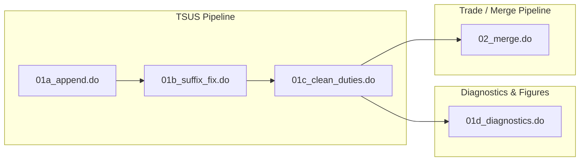

# DY--Analysis Integrated Guide Draft

This draft tests a combined documentation structure for the `DY--Analysis` workflow in `Shafaatyark/Tariffs-RAs`.

The main reading path follows the analysis scripts. Input and output data-file notes are kept inside one-level collapsible sections so the workflow stays readable while still preserving the data-guide context.

Source branch used for this draft: `Shafaatyark/Tariffs-RAs`, `DY--Analysis`.

## Workflow Overview



## Workflow Index

| Script | Main input | Main output | Purpose |
|---|---|---|---|
| `01a_append.do` | `verified_schedule1-8.xlsx` | `tsus_appended.dta` | Import, reshape, standardize, and append verified TSUS schedules |
| `01b_suffix_fix.do` | `tsus_appended.dta` | `tsus_uncorrected.dta` | Clean suffixes, create TSUSA codes, apply reference-rate fixes, expand suffix rows, and extend years |
| `01c_clean_duties.do` | `tsus_uncorrected.dta` | `tsus_final.dta` | Clean duty variables and save the final cleaned TSUS tariff dataset |
| `01d_diagnostics.do` | `tsus_final.dta` | figures and diagnostic output | Generate tariff-rate histograms, scatter plots, box plots, and diagnostic lists |
| `02_merge.do` | `tsus_final.dta`, annual trade files | `tsus_final_weights.dta`, `trade_appended.dta`, `tsus_trade_merged.dta` | Create weights, append trade data, and merge tariff data with import trade data |

---

## 01a_append.do

### Purpose

`01a_append.do` imports verified schedule Excel files, reshapes year-specific duty variables from wide format to long format, appends schedules 1 through 8, standardizes suffix formatting, and saves the combined TSUS dataset.

Before appending the schedules, the script standardizes key identifier variables. `item` and `suffix` are converted to strings to preserve code formatting, and `flag` and `unit_spec` are converted to strings when Stata imports them as numeric. This prevents type mismatches across schedules without relying on `append, force`.

### Inputs

<details>
<summary>Input: verified_schedule1-8.xlsx</summary>

`verified_schedule1-8.xlsx` represents the verified Excel schedule files created from the original TSUS PDFs. These files are the first structured data input in the TSUS workflow: they translate the raw tariff schedules into rows and columns that can be imported by `01a_append.do`.

The verified schedule files contain digitized TSUS schedule information for schedules 1 through 8. They preserve the core fields needed for later cleaning and analysis, including:

- tariff item codes;
- suffix codes;
- specific and ad valorem duty values;
- unit information;
- notes copied or summarized from the source schedules;
- flags for entries requiring special interpretation.

The schedules are stored as Excel files before being imported into Stata. Formatting choices such as text-formatted cells, preserved suffix values, and note fields matter because the later Stata scripts depend on these fields being readable and consistent.

</details>

### Outputs

<details>
<summary>Output: tsus_appended.dta</summary>

`tsus_appended.dta` is the intermediate Stata dataset created from the verified Excel schedule files. It combines schedules 1-8 after import, type standardization, reshape, and append, and prepares the data for suffix cleaning and TSUSA code construction in `01b_suffix_fix.do`.

By the time this file is created:

- the verified Excel schedules have been imported into Stata;
- schedule-level files have been combined into one dataset;
- key columns have been standardized so they can be appended together;
- year-specific duty columns have been reshaped into a long format;
- the data is ready for suffix cleaning and TSUSA code construction.

This file is not the final cleaned tariff dataset. It is an intermediate file used before suffix corrections, TSUSA construction, reference-rate fixes, and row expansion are applied.

</details>

### Code Explanation

The script loops through schedules 1 through 8, imports each verified Excel file, converts identifier and duty columns into consistent formats, reshapes duty columns into long format by year, and appends the schedule-level data into a single temporary dataset. After all schedules are combined, it drops empty columns, standardizes observed suffix formatting problems such as `0`, `000`, and `5`, sorts by item, and saves `tsus_appended.dta`.

---

## 01b_suffix_fix.do

### Purpose

`01b_suffix_fix.do` starts from the appended TSUS dataset, cleans suffix values, creates TSUSA codes, corrects ad valorem duty rates for selected related item groups using 320- and 301-series reference rates, expands suffix-specific rows for item groups 32000-33100, extends the dataset to 1973-1975 using 1972 as a template, cleans specific-duty variables, and saves the uncorrected TSUS dataset.

### Inputs

<details>
<summary>Input: tsus_appended.dta</summary>

`tsus_appended.dta` is the combined schedule dataset created by `01a_append.do`. It contains schedule 1-8 data imported from verified Excel schedule files, tariff item codes, suffixes, units, duty values, notes, flags, and year-specific rate columns after the initial import and reshape steps.

At this stage, the data is combined but not yet suffix-fixed. It is ready for suffix cleaning, TSUSA code construction, reference-rate fixes, and row expansion.

</details>

### Outputs

<details>
<summary>Output: tsus_uncorrected.dta</summary>

`tsus_uncorrected.dta` is the TSUS tariff dataset created after suffix cleaning, TSUSA code creation, rate fixes, row expansion, and year extension. In this workflow, `uncorrected` means that the dataset has not yet gone through the final duty-variable cleaning step in `01c_clean_duties.do`.

By the time this file is created:

- leading and trailing spaces have been removed from `item` and `suffix`;
- known non-code suffix markers, specifically `.` and `1/`, have been removed;
- remaining suffix values have been checked to make sure they contain only digits or are blank;
- `tsusa` codes have been created by combining the 5-digit item code with the suffix code, and recreated after suffix expansion;
- reference-rate cases, such as `320.--` and `301.--` style entries, have been handled;
- rows that apply to multiple suffix codes have been expanded so that duty rates are recorded at the correct suffix level;
- 1973-1975 rows have been added by copying the 1972 row structure;
- specific-duty fields have been parsed and converted into numeric values after the suffix expansion step.

Unlike `tsus_appended.dta`, this file is no longer just the combined import of schedules 1-8. It includes the suffix corrections, TSUSA construction, rate fixes, and row expansions needed before final duty cleaning.

</details>

### Code Explanation

The script builds suffix maps for 32000-33100 prefix groups, loads `tsus_appended.dta`, trims and validates suffix values, creates numeric TSUSA codes, and converts ad valorem duty variables to numeric. It then uses 320-series and 301-series reference-rate tables to calculate related rates, expands suffix `00` rows into valid suffix-specific rows, copies 1972 rows forward to 1973-1975, cleans specific-duty fields, and saves `tsus_uncorrected.dta`.

---

## 01c_clean_duties.do

### Purpose

`01c_clean_duties.do` loads the uncorrected TSUS dataset from `01b_suffix_fix.do`, checks duty variables for non-numeric and missing values, converts duty variables to numeric format, applies the existing ad valorem duty correction logic, and saves the final cleaned TSUS dataset.

### Inputs

<details>
<summary>Input: tsus_uncorrected.dta</summary>

`tsus_uncorrected.dta` is the suffix-fixed intermediate dataset created by `01b_suffix_fix.do`. It includes suffix corrections, TSUSA construction, reference-rate fixes, row expansion, 1973-1975 extension, and parsed specific-duty fields.

It is used as the input to `01c_clean_duties.do`, where final duty-variable cleanup is applied before the dataset becomes the main cleaned tariff file.

</details>

### Outputs

<details>
<summary>Output: tsus_final.dta</summary>

`tsus_final.dta` is the cleaned TSUS tariff dataset created after the suffix-fixed intermediate data has gone through final duty-variable cleaning and rate corrections. It is the main cleaned tariff file used for diagnostics, figures, weights, and trade-data merges.

By the time this file is created:

- duty variables have been checked for missing and non-numeric values;
- known text entries such as `base rate` have been recoded for later numeric processing;
- duty variables, `tsusa`, and `item` have been converted to numeric values where needed;
- selected 1969-1975 ad valorem duty values have been filled with the 1968 rate when the post-1968 values are all zero and the 1968 rate is positive;
- the dataset is ready to be used by `01d_diagnostics.do` for diagnostics and figures and by `02_merge.do` for weights and trade-data merges.

This file is the final cleaned tariff dataset in the workflow. Unlike `tsus_uncorrected.dta`, it has gone through the final duty-cleaning step and is the dataset used for downstream analysis outputs.

</details>

### Code Explanation

The script loads `tsus_uncorrected.dta`, inspects duty-variable types, sorts the data, trims specific-duty strings, lists non-numeric duty entries, counts missing values, temporarily recodes `base rate` as `999999`, verifies that non-numeric characters have been handled, destrings duty variables and identifiers, fills selected later-year ad valorem values from 1968 when later years are all zero, and saves `tsus_final.dta`.

---

## 01d_diagnostics.do

### Purpose

`01d_diagnostics.do` loads the final cleaned TSUS dataset, creates histograms, scatter plots, box plots, and diagnostic lists for ad valorem duty rates, and exports figure files. It does not save a new `.dta` dataset.

### Inputs

<details>
<summary>Input: tsus_final.dta</summary>

`tsus_final.dta` is the main cleaned tariff dataset created by `01c_clean_duties.do`. It contains the cleaned TSUS tariff data after suffix fixes, duty-variable cleanup, and selected ad valorem corrections.

In this stage, the file is used for diagnostic checks and figure generation. The script reads the file but does not replace it or create another tariff dataset.

</details>

### Outputs

<details>
<summary>Output: diagnostic figures and log files</summary>

`01d_diagnostics.do` exports diagnostic output rather than a new `.dta` file. Outputs include the script log and figure files such as histograms, 1968-versus-1972 scatter plots, after-fix comparison plots, box-and-whisker plots, and highlighted outlier plots.

These outputs help inspect the distribution of ad valorem duty rates, compare 1968 and 1972 rates, identify spikes and zeros, and flag unusual tariff-rate changes for review.

</details>

### Code Explanation

The script loads `tsus_final.dta`, exports histograms for column 1 and column 2 ad valorem duty rates, reshapes selected data to compare 1968 and 1972 rates side by side, creates scatter plots with reference lines, generates a box-and-whisker plot by year, counts high-end outliers, lists unusual duty-rate patterns, and exports highlighted diagnostic figures.

---

## 02_merge.do

### Purpose

`02_merge.do` prepares the final TSUS data for merging, creates a product-level weight file from 1976 import quantities, appends import data for 1968 through 1972, and merges the trade data onto the cleaned TSUS dataset.

The script saves three downstream datasets. First, it saves `tsus_final_weights.dta`, which adds quantity-based `spec_weight` values to selected TSUS items. Second, it saves `trade_appended.dta`, which combines the 1968-1972 import files. Third, it saves `tsus_trade_merged.dta`, which combines the cleaned TSUS tariff data with annual import data by `tsusa` and `year`.

### Inputs

<details>
<summary>Input: tsus_final.dta</summary>

`tsus_final.dta` is the cleaned TSUS tariff dataset created by `01c_clean_duties.do`. In `02_merge.do`, it is used as the cleaned tariff base for weighting and trade-data merge steps.

The script converts `tsusa` to numeric where needed so the tariff data can be matched with trade data using a consistent merge key format.

</details>

<details>
<summary>Input: annual import trade files</summary>

The annual import trade inputs include `Imports-1968.dta` through `Imports-1972.dta` for the trade append step and `Imports-1976.dta` for the product-weight step.

The 1968-1972 files are appended into `trade_appended.dta`. The 1976 file is used to calculate quantity-based `spec_weight` values for selected schedule 6 TSUS items.

</details>

### Outputs

<details>
<summary>Output: tsus_final_weights.dta</summary>

`tsus_final_weights.dta` is an intermediate weighted tariff file created by calculating quantity-based `spec_weight` values from 1976 import data and merging those weights onto the cleaned TSUS dataset.

The weight is calculated as:

```text
spec_weight = con_qy2_yr / (con_qy1_yr + con_qy2_yr)
```

Because the 1976 import data can have multiple observations for the same `tsusa`, the script averages `spec_weight` by `tsusa` to create one product-level weight per TSUS code. The product-level weights are then merged onto `tsus_final.dta`.

</details>

<details>
<summary>Output: trade_appended.dta</summary>

`trade_appended.dta` is the combined import trade dataset created from the 1968-1972 raw import files. It is used as the trade-data input for creating `tsus_trade_merged.dta`.

By the time this file is created:

- the annual import files for 1968-1972 have been combined into one dataset;
- `tsusa` has been converted to a numeric variable so it can be merged with the cleaned tariff data;
- the combined trade file is ready to be merged with `tsus_final.dta` by `tsusa` and `year`.

Compared with `tsus_trade_merged.dta`, this file contains only the appended trade data. It does not yet include the cleaned TSUS tariff rates from `tsus_final.dta`.

</details>

<details>
<summary>Output: tsus_trade_merged.dta</summary>

`tsus_trade_merged.dta` is the analysis-ready merge output that combines cleaned TSUS tariff data with appended 1968-1972 import trade files by `tsusa` and `year`.

The final merge is run conceptually as:

```stata
use "$data\\Stata Files\\tsus_final.dta", clear
merge 1:m tsusa year using "$data\\Stata Files\\trade_appended.dta"
save "$data\\Stata Files\\tsus_trade_merged.dta", replace
```

This is a `1:m` merge because `tsus_final.dta` is the master file in this step. For each `tsusa`-`year` combination, it provides the cleaned tariff schedule information. `trade_appended.dta` is the using file, and it can contain multiple import trade records for the same `tsusa`-`year` combination.

After the merge:

- compared with `tsus_final.dta`, this file adds import trade data;
- compared with `trade_appended.dta`, this file adds the cleaned TSUS tariff rates and schedule information;
- the file becomes the analysis-ready dataset for work that needs both tariff information and import trade data in the same file.

</details>

### Code Explanation

The script loads `tsus_final.dta`, converts `tsusa` to numeric, saves the cleaned tariff file, loads 1976 import data to calculate quantity-based `spec_weight`, collapses weights to one row per `tsusa`, merges those weights onto the cleaned TSUS data, and saves `tsus_final_weights.dta`. It then loads the 1968 import file, appends the 1969-1972 import files, converts `tsusa` to numeric, saves `trade_appended.dta`, reloads `tsus_final.dta`, merges trade data by `tsusa` and `year`, and saves `tsus_trade_merged.dta`.

---

## Notes on This Draft Structure

- The analysis script remains the main reading unit.
- Data-file explanations appear only when the reader expands the relevant input or output.
- This uses only one level of `<details>` blocks.
- The `data_guide` content is reorganized around the workflow steps instead of being kept as a separate reading path.
- If this structure works, the same format can be expanded with fuller commented code blocks from the existing `analysis_guide` files.
